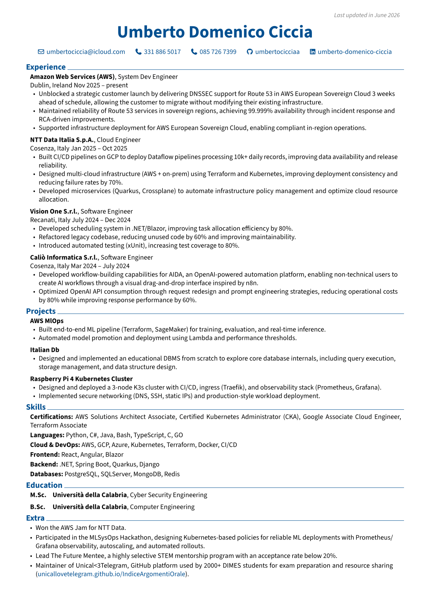

# umbertodomenico-ciccia-resume

Cv Umbert Domenico Ciccia, made with [rendercv](https://github.com/rendercv/rendercv)

## Installation

MACOS Installation:

```zsh
python3 -m venv .venv
source .venv/bin/activate 
pip install -r requirements.txt
```

## CV Creation

Create a new CV yaml file:

```python
rendercv new "John Doe"
```

Edit the YAML, then render:

```python
rendercv render "John_Doe_CV.yaml"
```

## Demo

